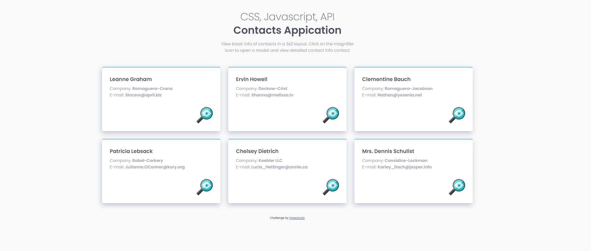

# Frontend Exercise

This is the mockup we want to convert to a web page using HTML and CSS. You can find the mockup files for desktop and mobile views, in **/design folder**.

## The challenge

Fetch user data from https://jsonplaceholder.typicode.com/users?_start=0&_limit=6. Present them in a 3x2 layout. Preserve 3x2, 2x3 1x6 layout while contracting browser window. Follow the **modal-design-placeholder** and **user-card-design-placeholder** files in **/design folder** to place the right info on the right place.

Users should be able to:

- View the optimal layout for the site depending on their device's screen size
- On hover on each card, the card moves slightly upwards
- Clicking on the magnifier icon should open a modal with current user detailed information. Optionaly animate the modal opening.
- Clicking on the X element next to modal header the modal should close
- Clicking outside of the modal, the modal should close
- Modal should be responsive

## Built with

- Semantic HTML5 markup
- CSS custom properties
- Flexbox or CSS Grid
- Mobile-first workflow
   
   
   

# Front-end Style Guide

## Layout

The designs were created to the following widths:

- Mobile: 375px
- Desktop: 1440px

## Colors

### Primary

- Cyan: hsl(180, 62%, 55%)

### Neutral

- Very Dark Blue: hsl(234, 12%, 34%)
- Grayish Blue: hsl(229, 6%, 66%)
- Very Light Gray: hsl(0, 0%, 98%)

## Typography

### Body Copy

- Font size: 15px

### Fonts

- Family: [Poppins](https://fonts.google.com/specimen/Poppins)
- Weights: 200, 400, 600
